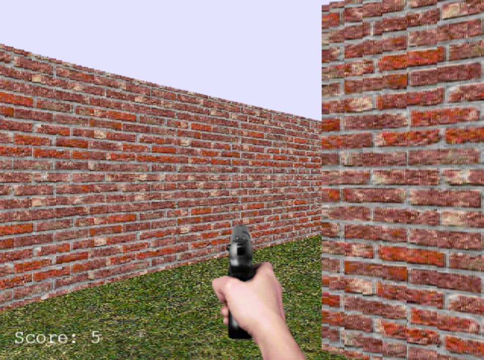
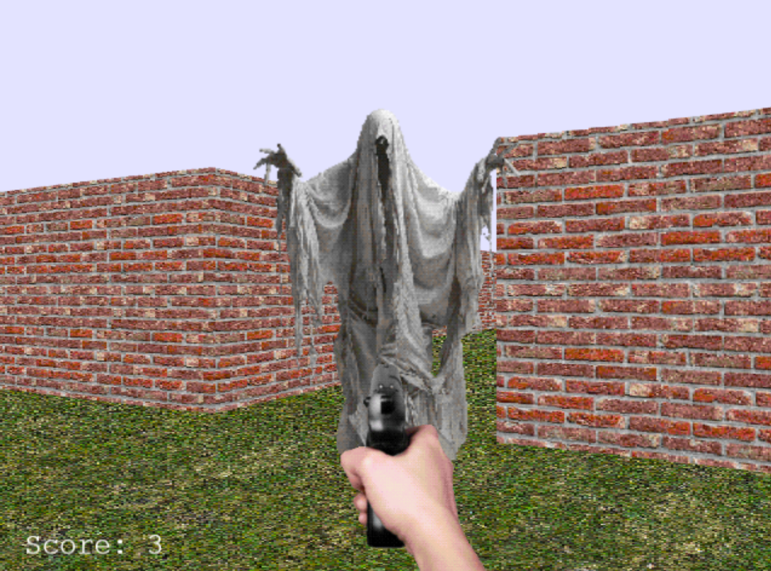

# FP(js)S

A simple first-person shooter game made with JavaScript using Phaser. This was made as a short experiment to see how making 3D games using raycasting works.

## Controls

| Key | Action |
| - | - |
| ↑ | Move forward |
| ↓ | Move backward |
| ← | Turn left |
| → | Turn right |
| Space | Shoot |

## How It Works

The game world is represented as a simple 2D grid where `#` represents walls and empty spaces represent walkable areas.

Rays are cast from the player's position to determine the walls visible from the player's perspective. The distance to each wall determines its size on screen, creating the 3D effect.

The floor uses floor casting to calculate the corresponding world position for each part of the screen and sample the grass texture from that location. This makes the floor behave like an actual tiled surface that moves with the player.

## Built With

- JavaScript
- Phaser 3
- HTML5 Canvas
